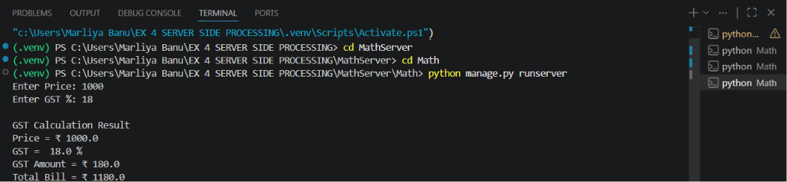
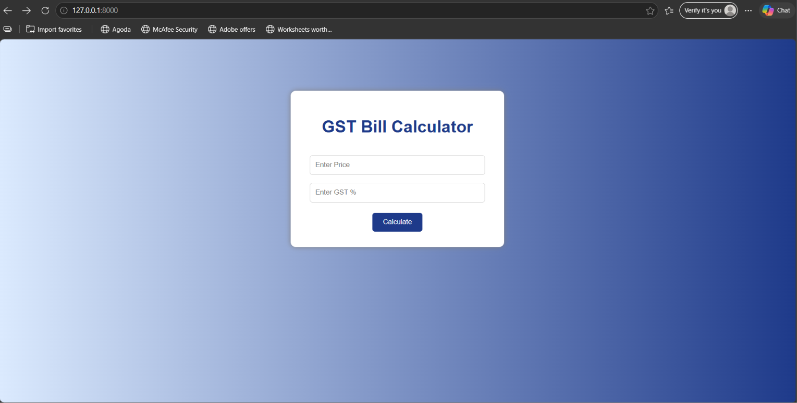
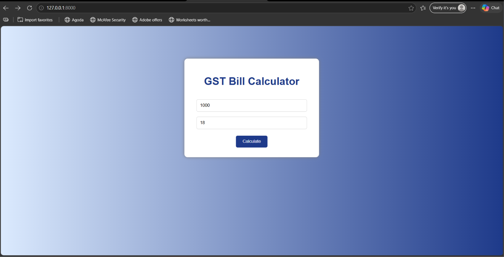
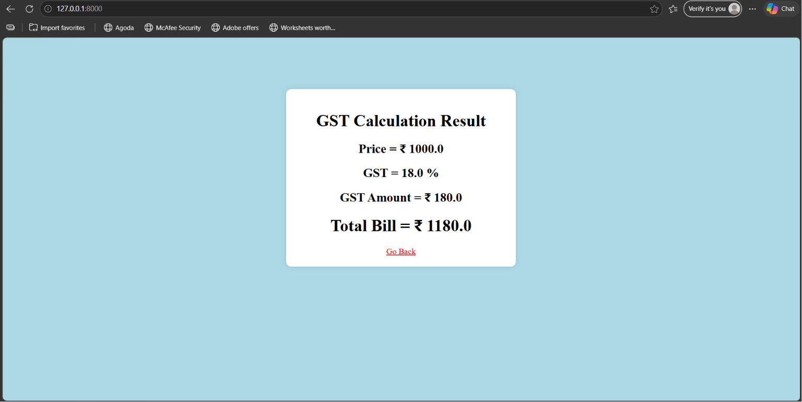

# Ex.04 Design a Website for Server Side Processing
## Date:21/5/26

## AIM:
To create a web page to calculate total bill amount with GST from price and GST percentage using server-side scripts.

## FORMULA:
Bill = P + (P * GST / 100)
<br> P --> Price (in Rupees)
<br> GST --> GST (in Percentage)
<br> Bill --> Total Bill Amount (in Rupees)

## DESIGN STEPS:

### Step 1:
Clone the repository from GitHub.

### Step 2:
Create Django Admin project.

### Step 3:
Create a New App under the Django Admin project.

### Step 4:
Create a HTML file to implement form based input and output.

### Step 5:
Create python programs for views and urls to perform server side processing.

### Step 6:
Receive input values from the form using request.POST.get().

### Step 7:
Calculate the total bill amount (including GST).

### Step 8:
Display the calculated result in the server console.

### Step 9:
Render the result to the HTML template.

### Step 10:
Publish the website in Localhost.

## PROGRAM:
```
Index.html

<!DOCTYPE html>
<html>

<head>

    <title>GST Calculator</title>

    <style>

        body{
            font-family: Arial;
            background: linear-gradient(to right, #dbeafe, #1e3a8a);
        }

        .box{
            width: 350px;
            background: white;
            padding: 30px;
            margin: auto;
            margin-top: 100px;
            border-radius: 10px;
            text-align: center;
            box-shadow: 0px 0px 10px gray;
        }

        h1{
            color: #1e3a8a;
        }

        input{
            width: 90%;
            padding: 10px;
            margin-top: 15px;
            border: 1px solid lightgray;
            border-radius: 5px;
        }

        button{
            background: #1e3a8a;
            color: white;
            padding: 10px 20px;
            margin-top: 20px;
            border: none;
            border-radius: 5px;
        }

        h2{
            color: darkgreen;
        }

    </style>

</head>

<body>

    <div class="box">

        <h1>GST Bill Calculator</h1>

        <form method="POST">

            

            <input type="number" name="price" placeholder="Enter Price" required>

            <input type="number" name="gst" placeholder="Enter GST %" required>

            <button type="submit">Calculate</button>

        </form>

        

        <h2>Total Bill = ₹ {{ total_bill }}</h2>

        

    </div>

</body>

</html>


Result.html

<!DOCTYPE html>
<html>
<head>
    <title>GST Result</title>
</head>

<body bgcolor="lightblue">
     <style>

        .box{
            width: 400px;
            padding: 20px;
            background: white;
            margin: 100px auto;
            border-radius: 10px;
            box-shadow: 0 0 10px rgba(0,0,0,0.1);
            text-align: center;
        }
        </style>
<div class="box">
<center>

    <h1>GST Calculation Result</h1>

    <h2>Price = ₹ {{ price }}</h2>

    <h2>GST = {{ gst }} %</h2>

    <h2>GST Amount = ₹ {{ gst_amount }}</h2>

    <h1>Total Bill = ₹ {{ total_bill }}</h1>

    <a href="/" style='color: red; text-decoration: underline;'>Go Back</a>

</center>
</box>

    

</body>
</html>

models.py 
from django.db import models
from django.contrib import admin

class GSTBill(models.Model):
    bill_id = models.IntegerField(primary_key=True)
    price = models.FloatField()
    gst = models.FloatField()
    gst_amount = models.FloatField()
    total_bill = models.FloatField()
    
class GSTBillAdmin(admin.ModelAdmin):
    list_display = ('bill_id', 'price', 'gst', 'gst_amount', 'total_bill')

    apps.py
    price = float(input("Enter Price: "))
gst = float(input("Enter GST %: "))

gst_amount = (price * gst) / 100
total_bill = price + gst_amount

# SERVER SIDE OUTPUT
print("\nGST Calculation Result")
print("Price = ₹", price)
print("GST = ", gst, "%")
print("GST Amount = ₹", gst_amount)
print("Total Bill = ₹", total_bill)

views.py
from django.shortcuts import render

def gst(request):
    if request.method == 'POST':
        price = float(request.POST.get('price', 0))
        gst = float(request.POST.get('gst', 0))
        
        gst_amount = price * (gst / 100)
        total_bill = price + gst_amount
        
        context = {
            'price': price,
            'gst': gst,
            'gst_amount': gst_amount,
            'total_bill': total_bill
        }
        
        return render(request, 'result.html', context)
    
    return render(request, 'index.html')
```

## OUTPUT - SERVER SIDE:


## OUTPUT - WEBPAGE:




## RESULT:
The a web page to calculate total bill amount with GST from price and GST percentage using server-side scripts is created successfully.
